# String-Art-Machine
An automated String Art machine that performs both the automated nailing process and the string weaving process.

## Introduction

This project presents an automated String Art machine designed to handle both the automated nailing and string weaving processes. The system architecture integration and control flow are built upon the following core components:

* **Control Unit & Embedded System:** Powered by an **ESP32-WROOM-32** microcontroller managing real-time motion control, sensor data processing, and execution commands.
* **Software & Image Processing:** A **Python**-based framework is utilized to convert digital source images into optimized string-path coordinates and numerical control data.
* **Position Tracking & Feedback System:** To ensure high-precision positioning and prevent accumulative mechanical errors during operation, the system employs a robust feedback mechanism:
  * A **NEMA23 Closed-Loop Stepper Motor** with an integrated encoder to prevent step loss.
  * **Optical Limit Switch Endstops** serving as red-light sensors for precise homing, position validation, and path tracking.

## Hardware Components

The primary hardware and mechatronic components utilized in this project are listed below along with their corresponding visual documentation and technical reference links:

### 1. Controllers & Microcontrollers
* **Microcontroller:** [ESP32-WROOM-32](https://documentation.espressif.com/esp32-wroom-32_datasheet_en.pdf)(Handles real-time motion control and sensor data processing)

* **Signal Converters:** [MAX485 / RS485-TTL Module](https://login.pcbpower.com/Documents/0252d3ac-d61f-43a7-9b96-010299e5181c/PM14058.pdf) (Converts RS485 differential signals from encoders into TTL logic for the ESP32)

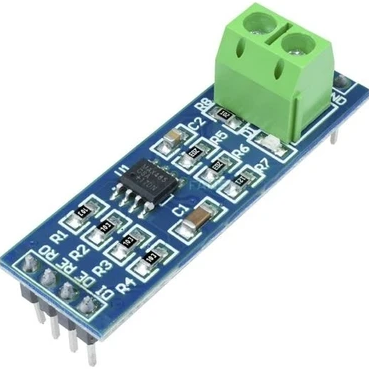

### 2. Actuators, Drivers & Encoders
* **Motor:** [NEMA23 Closed Loop Stepper Motor (CS-M22323)](https://www.damencnc.com/userdata/file/6023-3_Closed_Loop_Stepper_Motor_NEMA23-2.3Nm_CS-M22323_2D_Dimensions.pdf) (2.3 Nm) with integrated encoder to prevent step loss.

* **Driver:** [CS-D508 Encoder-Integrated Stepper Motor Driver](http://leadshineusa.com/UploadFile/Down/CS-D508_m3.1.pdf) (24-48V).

* **Drill Motor:** [RS-775 DC Motor](https://www.handsontec.com/dataspecs/motor_fan/775-Motor.pdf) (High-torque DC motor driving the drilling mechanism).

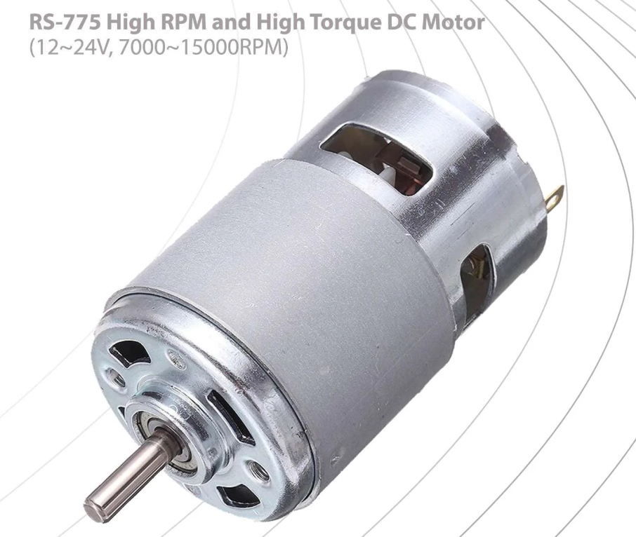

* **Servos:** [MG995 TowerPro Metal Gear Servo](https://www.electronicoscaldas.com/datasheet/MG995_Tower-Pro.pdf) (High-torque servos used for the drill depth actuation and slider mechanisms).

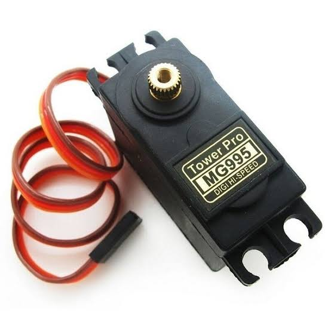

### 3. Power Supplies (SMPS)
The system utilizes dedicated Switch Mode Power Supplies to separate power stages for stability:
* **48V Supply:** [MT-500-48 SMPS](https://mervesanteknoloji.com/statics/file/MT-500-xx-_2.pdf) (48V, 10A) - Powering the main motor drivers.

* **36V Supply:** [MT-350-36 SMPS](https://mervesanteknoloji.com/statics/file/2020-6-8_user_manual_MT-350-XX_2_1.pdf) (36V, 10A).

* **24V Supply:** [Mervesan MT-250-24 SMPS](https://mervesanteknoloji.com/statics/file/MTLRS-250-24_Manua_ver-1.0.pdf) (24VDC, 10A).

### 4. Voltage Regulation (DC-DC Step-Down)
* **High-Power Buck Converters:** 3x [XL4016 DC-DC Step Down Regulator Modules](https://www.mikrocontroller.net/attachment/534859/XL4016_Step_Down_Buck_DC_DC_Converter.pdf) (300W, 10A).
  * *Note on Implementation:* One of these buck converters replaces a standard XL4016 module, as the high-capacity XL4016 was readily available and deployed to maintain power consistency across the logic and sensor circuits.

| XL4016 300w | XL4016 200w |
| :---: | :---: |
|  |  |

### 5. Sensors & Position Tracking
* **Optical Sensors:** [Optical Limit Switch Endstops](https://www.handsontec.com/dataspecs/sensor/Optical%20end%20stop.pdf) (Dimensions: 33 x 12 x 10 mm) used for precise homing, position validation, and path tracking.

## Mechanical Design & Assembly

The mechanical structure of the String Art machine is detailed in this section. The design progresses from the top-level system assembly down to the individual custom-designed components.

### 1. System Overview (Top View)
The main layout of the system, illustrating the positioning and integration of the mechanical and electronic sub-assemblies, is provided below.

* **Top View Drawing:** [`drawing_top_view.pdf`](./solid/drawing_top_view.pdf)
### 2. Custom Components
The following custom parts were designed for the physical construction of the machine. Universal `.step` files are provided for replication, alongside visual references for each component.

* **Drill Main Unit:** Core housing for the drilling mechanism.
  
  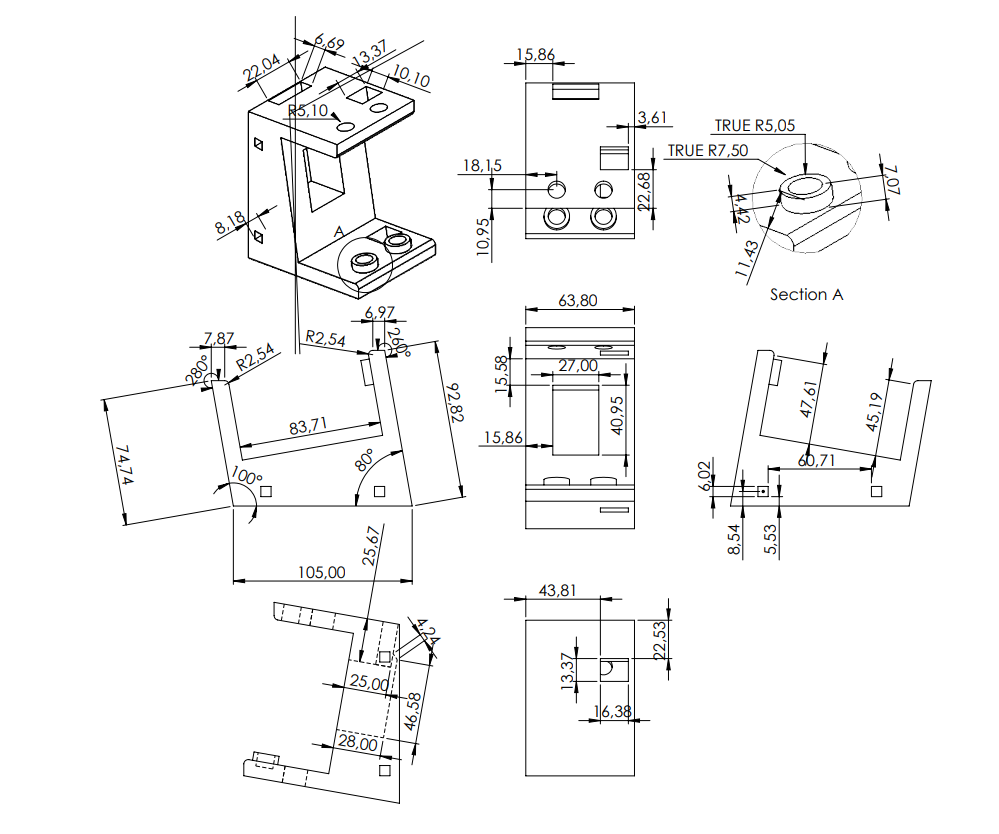

  * **File:** [`drill_main_unit.step`](./solid/drill_main_unit.step)
* **Drill Mounting Rod:** Structural support component for the drill unit.
  
  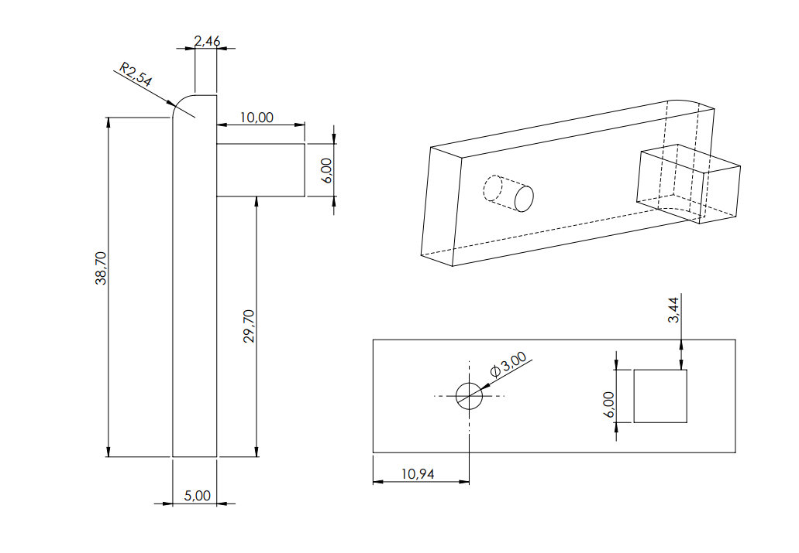

  * **File:** [`drill_mounting_rod.step`](./solid/drill_mounting_rod.step)
* **Drill Servo Gear:** Transmission gear for the servo-actuated mechanism.

  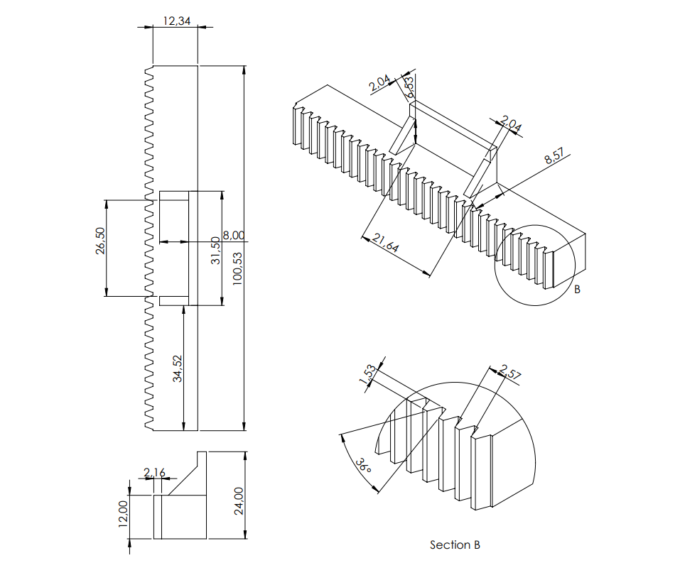

  * **File:** [`drill_servo_gear.step`](./solid/drill_servo_gear.step)
* **Motor Mount:** Bracket designed to secure the NEMA23 closed-loop stepper motors.
  
  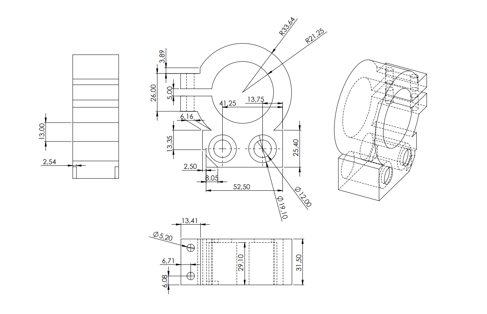

  * **File:** [`motor_mount.step`](./solid/motor_mount.step)
* **Slider End:** End effector and guide component for the linear motion axis.
  
  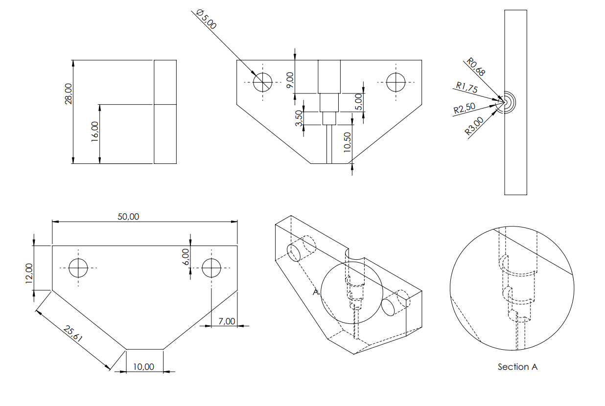

  * **File:** [`slider_end.step`](./solid/slider_end.step)
* **Chassis:** The primary structural frame supporting the entire operation.
 
  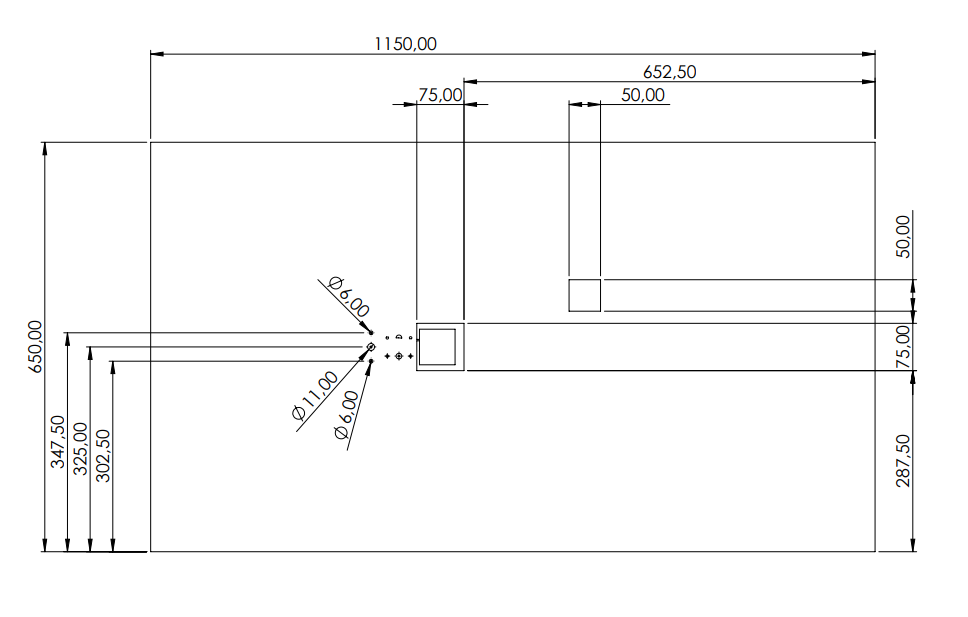

  * **File:** [`chassis.step`](./solid/chassis.step)
* **Table / Bed:** The main work surface where the string art generation takes place.
  
  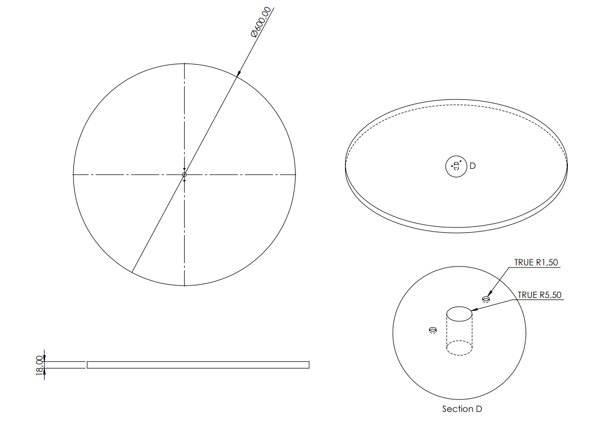

   * **File:** [`table_bed.step`](./solid/frame.step)

## System Wiring & Connections

To ensure system stability, prevent step loss, and protect the low-voltage microcontroller components, the electrical architecture is divided into three isolated stages. 

*(Note: Ensure all sub-systems share a physical **Common GND** network to prevent signal noise).*

### 1. Power Distribution Layout
This section details the AC-to-DC power routing, voltage regulation stages, and the common ground network used to power the system.

* **AC Mains Input:** 220V AC grid ($L, N, \text{PE}$) supplies power to the primary SMPS units.
* **Main SMPS Units (Power Supply):** 
  * **MT-500-48 SMPS (48V, 10A):** Dedicated to powering the main NEMA23 closed-loop stepper motor driver (CS-D508).
  * **MT-350-36 SMPS (36V, 10A):** Supplies power for the auxiliary motor drivers.
  * **Mervesan MT-250-24 SMPS (24V, 10A):** Provides base voltage for DC motor drivers and DC-DC step-down modules.
* **DC-DC Step-Down Stages (Voltage Regulation):**
  * **XL4016 Buck Converter 1:** Steps down voltage to **5V** to supply logic power for sensors, encoders, servos, and level shifters.
  * **XL4016 Buck Converter 2:** Steps down voltage to **3.3V** to power the ESP32 microcontroller.

### 2. Logic Level Shifting & MCU Interface
This section details the control signal pathways and pin mappings between the low-voltage ESP32 and the 5V peripheral interfaces.

The ESP32 operates at a **3.3V logic level**. Level shifters are dedicated specifically to stepping down **5V signal outputs** (such as encoder receiver outputs, sensor signals, and driver feedback) down to **3.3V** to protect the ESP32 GPIO pins, while control output signals are driven directly from the microcontroller.

| Component | Signal Type | ESP32 Pin (3.3V) | Level Shifter Direction | Peripheral Pin (5V) |
| :--- | :--- | :---: | :---: | :--- |
| **Stepper Driver (CS-D508)** | Pulse | `P18` | Direct (3.3V) | `PUL+` (Blue) |
| | Direction | `P19` | Direct (3.3V) | `DIR+` (Brown) |
| | Enable | `P17` | Direct (3.3V) | `ENA+` (Green) |
| | Alarm | `P16` | 5V $\rightarrow$ 3.3V | `ALM+` (Orange) |
| **DC Motor Driver (BTS7960)**| Forward PWM | `P26` | Direct (3.3V) | `RPWM` |
| | Reverse PWM | `P27` | Direct (3.3V) | `LPWM` |
| | Right Enable | `P25` | Direct (3.3V) | `R_EN` |
| | Left Enable | `P25` | Direct (3.3V) | `L_EN` |
| **Servos (MG995)** | Drill PWM | `P21` | Direct (3.3V) | Signal (Drill Servo) |
| | Slider PWM | `P14` | Direct (3.3V) | Signal (Slider Servo) |
| **Encoders (RS485-TTL)** | Encoder 1 (RO) | `P22` | 5V $\rightarrow$ 3.3V | `RO` (Green/Red) |
| | Encoder 2 (RO) | `P23` | 5V $\rightarrow$ 3.3V | `RO` (Yellow/Blue) |
| **Sensors** | Optical Sensor | `P32` | 5V $\rightarrow$ 3.3V | Signal Output |

### 3. Actuators & Closed-Loop Feedback Connections
This section outlines the high-current drive outputs, motor phase connections, and hardware-level feedback routing.

* **Main Motion Control:**
  * The **CS-D508 Stepper Driver** receives power from the 48V SMPS and outputs high-current drive signals to the **NEMA23 Closed-Loop Stepper Motor (CS-M22323)** phases.
  * **Feedback Loop:** The integrated encoder on the rear of the NEMA23 motor routes directly back to the dedicated feedback port on the CS-D508 driver. This ensures hardware-level correction to prevent step loss without adding processing overhead to the ESP32.
* **Auxiliary Actuation (Nailing & Stringing Mechanisms):**
  * The **BTS7960 DC Motor Driver** controls the **RS-775 DC Motor** for high-torque operations (such as the drilling/nailing spindle).
  * The **MG995 Servos** draw power from the 5V regulated line and receive direct PWM signals from the ESP32 to actuate the slider and depth mechanisms.

## System Integration & Real-World Assembly

This section documents the physical construction of the String Art machine, showcasing the integration of mechanical parts, electronics, and the execution of the main automated processes.

### 1. Component Placement & Wiring
* **Power Supply & Motor Installation:** The physical layout of the main power distribution (48V, 36V, 24V SMPS) alongside the NEMA23 Closed-Loop Stepper Motor and its driver.

  

* **Mobility & Chassis Support:** The real-world installation of the caster wheel, ensuring chassis mobility and proper leveling during operation.
* 
  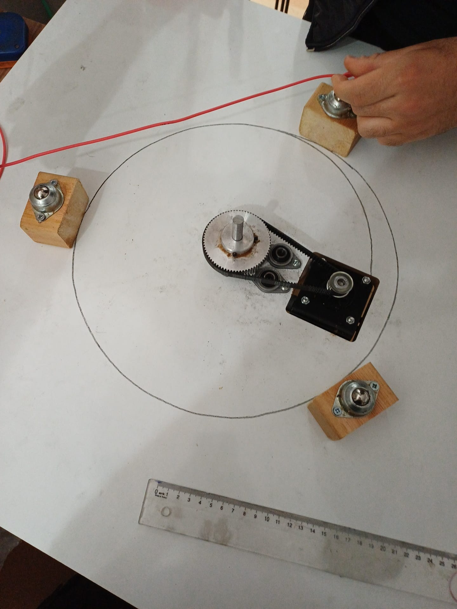

### 2. Operational Stages
* **Automated Nailing Process:** The end-effector mechanism drilling guidelines and precisely inserting pins/nails into the circular bed.

| Nailing Assembly 1 | Nailing Assembly 2 | Nailing Mechanism |
| :---: | :---: | :---: |
|  | 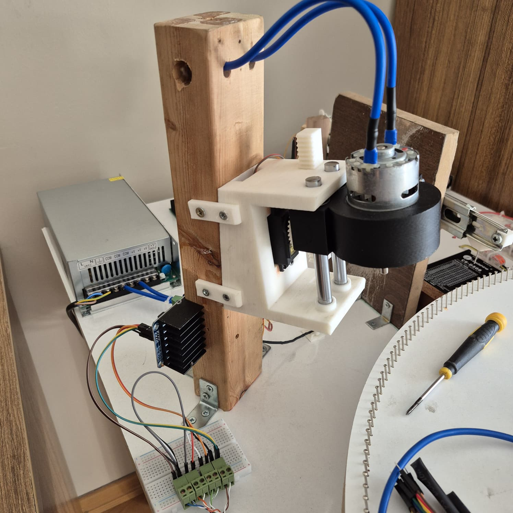 | 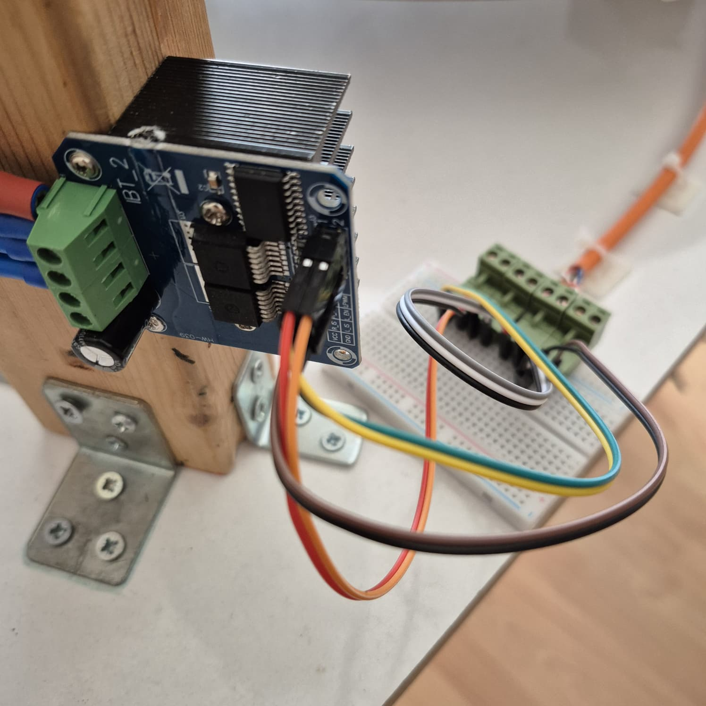 |

* **String Weaving Process:** The automated routing of the string across the predefined coordinate paths.

  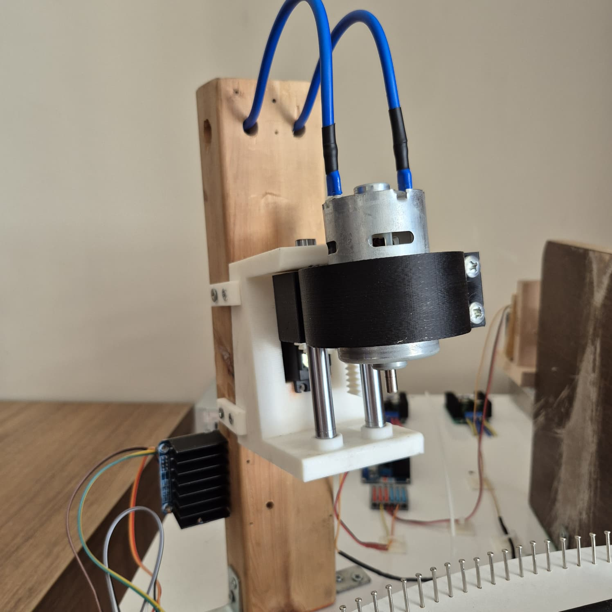

---

## Software Architecture & Algorithm Breakdown

This section documents the software framework and the core image-to-string processing pipeline. The complete source code files are hosted directly within the repository files.

### 1. Image Processing & String Generation Pipeline
The **Python**-based framework processes digital source images, applies localized optimization algorithms, and generates numerical control paths for the ESP32 microcontroller.

**Key Software Modules & Operations to Document:**
* **Image Pre-processing Module:** Grayscale conversion, contrast adjustment, and cropping filters.
* **Algorithm Core:** Calculations mapping string density, line intersections, and nail-to-nail path sequences.
* **Data Exporter:** Generation of numerical control data arrays and transmission protocols sent to the ESP32.

### 2. Algorithmic Transformation (Sample Input vs. Output)
Below is a visual representation of how the Python pipeline transforms a standard raster image into a vector-mapped string-art pattern:

| Source Input Image (Girdi) | Algorithmic String Output (Çıktı) |
| :---: | :---: |
|  |  |

---
