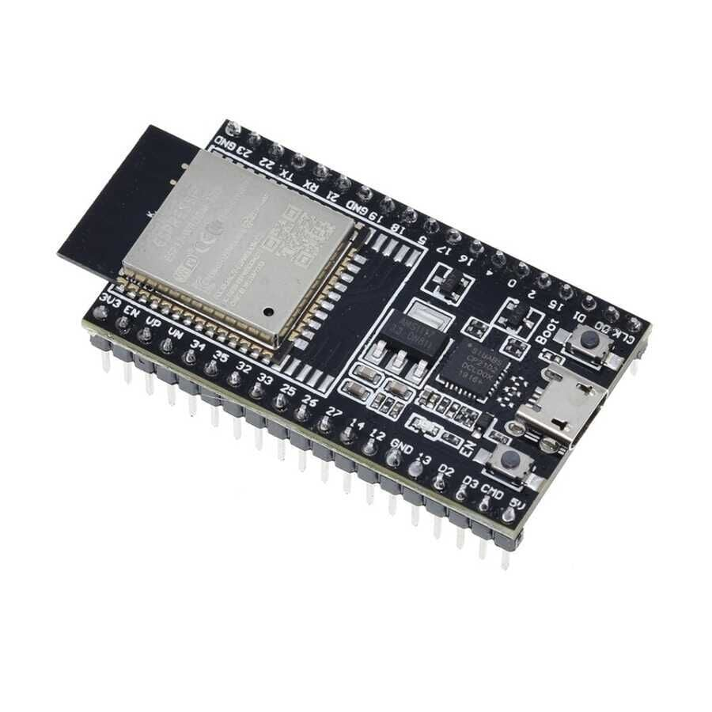
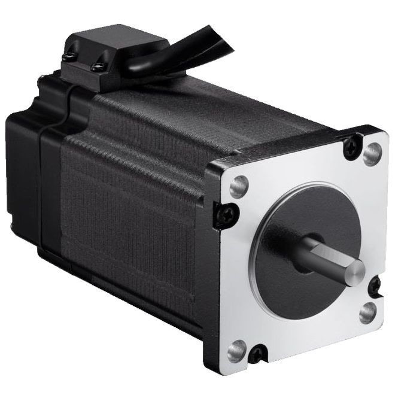
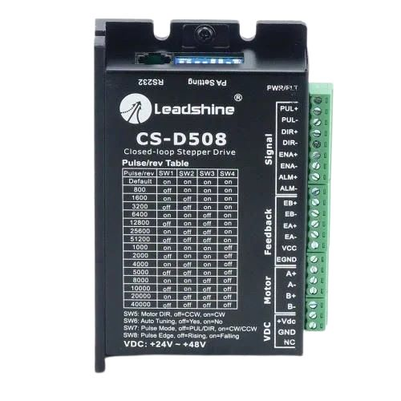
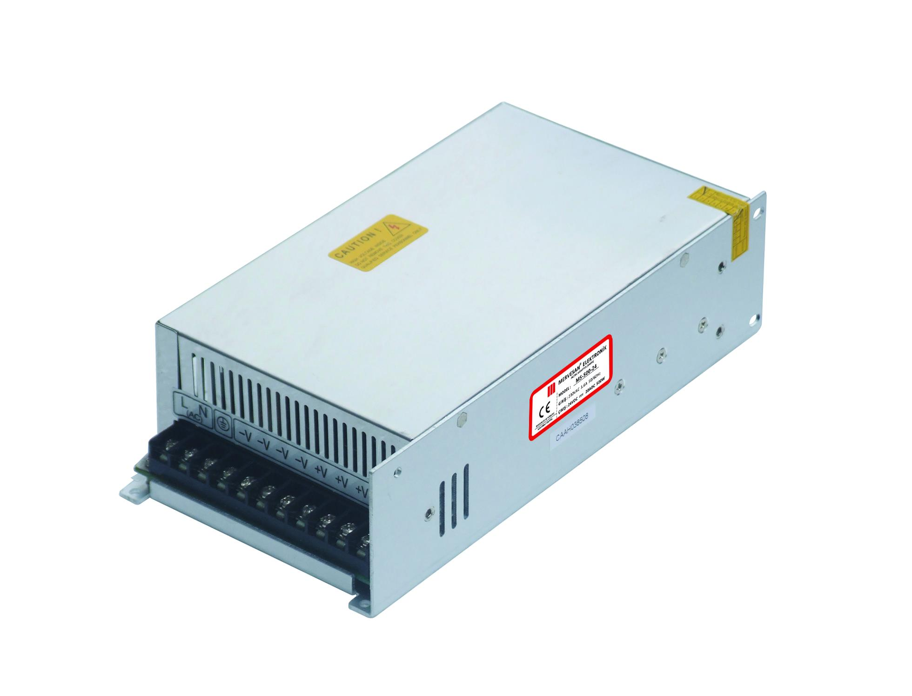
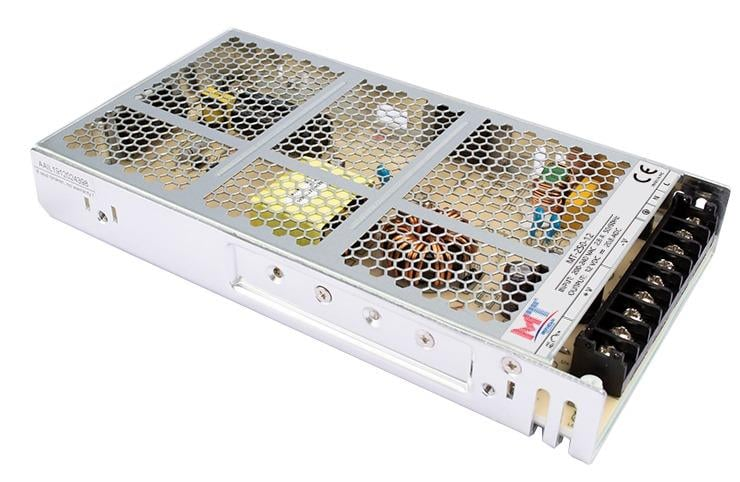
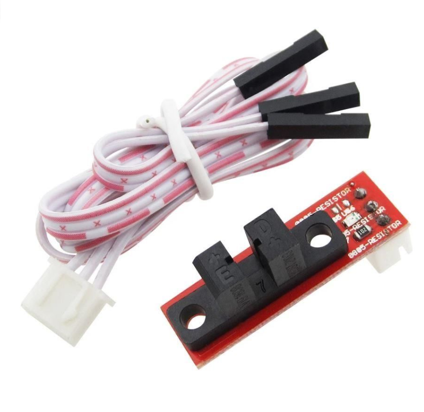

# String-Art-Machine
An automated String Art machine that performs both the automated nailing process and the string weaving process.

## Introduction

This project presents an automated String Art machine designed to handle both the automated nailing and string weaving processes. The system architecture integration and control flow are built upon the following core components:

* **Control Unit & Embedded System:** Powered by an **ESP32-WROOM-32d** microcontroller managing real-time motion control, sensor data processing, and execution commands.
* **Software & Image Processing:** A **Python**-based framework is utilized to convert digital source images into optimized string-path coordinates and numerical control data.
* **Position Tracking & Feedback System:** To ensure high-precision positioning and prevent accumulative mechanical errors during operation, the system employs a robust feedback mechanism:
  * A **NEMA23 Closed-Loop Stepper Motor** with an integrated encoder to prevent step loss.
  * **Optical Limit Switch Endstops** serving as red-light sensors for precise homing, position validation, and path tracking.

# String-Art-Machine
An automated String Art machine that performs both the automated nailing process and the string weaving process.

## Introduction

This project presents an automated String Art machine designed to handle both the automated nailing and string weaving processes. The system architecture integration and control flow are built upon the following core components:

* **Control Unit & Embedded System:** Powered by an **ESP32-WROOM-32d** microcontroller managing real-time motion control, sensor data processing, and execution commands.
* **Software & Image Processing:** A **Python**-based framework is utilized to convert digital source images into optimized string-path coordinates and numerical control data.
* **Position Tracking & Feedback System:** To ensure high-precision positioning and prevent accumulative mechanical errors during operation, the system employs a robust feedback mechanism:
  * A **NEMA23 Closed-Loop Stepper Motor** with an integrated encoder to prevent step loss.
  * **Optical Limit Switch Endstops** serving as red-light sensors for precise homing, position validation, and path tracking.

## Hardware Components

The primary hardware and mechatronic components utilized in this project are listed below along with their corresponding visual documentation and technical reference links:

### 1. Controllers & Microcontrollers
* **Microcontroller:** [ESP32-WROOM-32](https://documentation.espressif.com/esp32-wroom-32d_esp32-wroom-32u_datasheet_en.pdf) (Handles real-time motion control and sensor data processing).

### 2. Actuators, Drivers & Encoders
* **Motor:** [NEMA23 Closed Loop Stepper Motor (CS-M22323)](https://www.damencnc.com/userdata/file/6023-3_Closed_Loop_Stepper_Motor_NEMA23-2.3Nm_CS-M22323_2D_Dimensions.pdf) (2.3 Nm) with integrated encoder to prevent step loss.

* **Driver:** [CS-D508 Encoder-Integrated Stepper Motor Driver](http://leadshineusa.com/UploadFile/Down/CS-D508_m3.1.pdf) (24-48V).

### 3. Power Supplies (SMPS)
The system utilizes dedicated Switch Mode Power Supplies to separate power stages for stability:
* **48V Supply:** [MT-500-48 SMPS](https://mervesanteknoloji.com/statics/file/MT-500-xx-_2.pdf) (48V, 10A) - Powering the main motor drivers.

* **36V Supply:** [MT-350-36 SMPS](https://mervesanteknoloji.com/statics/file/2020-6-8_user_manual_MT-350-XX_2_1.pdf) (36V, 10A).

* **24V Supply:** [Mervesan MT-250-24 SMPS](https://mervesanteknoloji.com/statics/file/MTLRS-250-24_Manua_ver-1.0.pdf) (24VDC, 10A).

### 4. Voltage Regulation (DC-DC Step-Down)
* **High-Power Buck Converters:** 3x [XL4016 DC-DC Step Down Regulator Modules](https://www.mikrocontroller.net/attachment/534859/XL4016_Step_Down_Buck_DC_DC_Converter.pdf) (300W, 10A).
  * *Note on Implementation:* One of these buck converters replaces a standard XL4016 module, as the high-capacity XL4016 was readily available and deployed to maintain power consistency across the logic and sensor circuits.

### 5. Sensors & Position Tracking
* **Optical Sensors:** [Optical Limit Switch Endstops](https://www.handsontec.com/dataspecs/sensor/Optical%20end%20stop.pdf) (Dimensions: 33 x 12 x 10 mm) used for precise homing, position validation, and path tracking.

