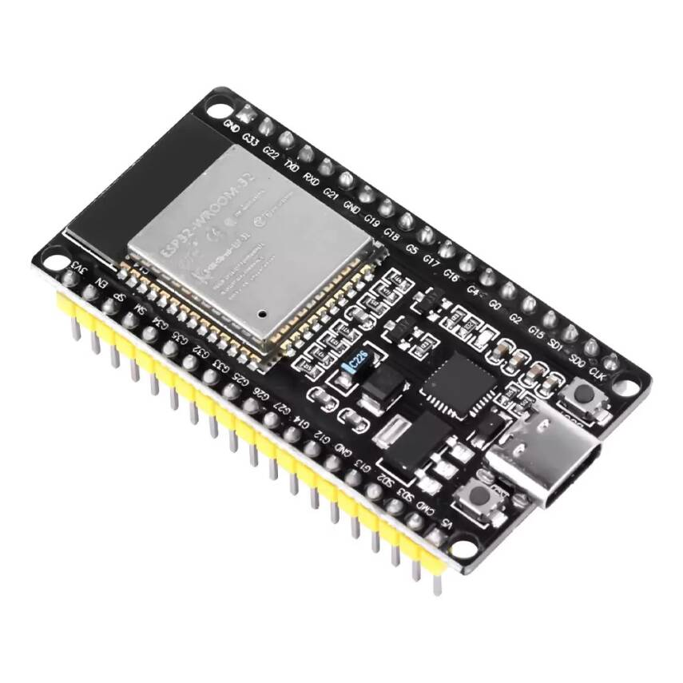
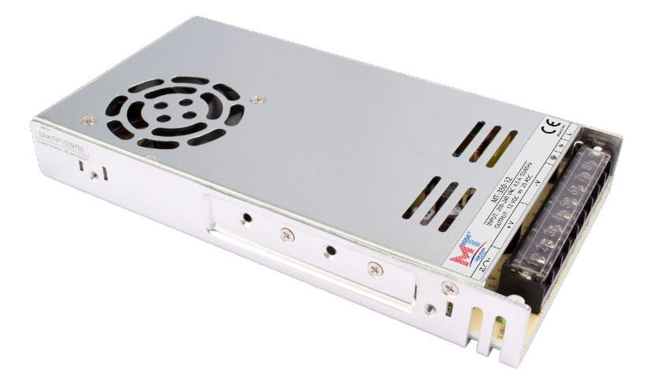
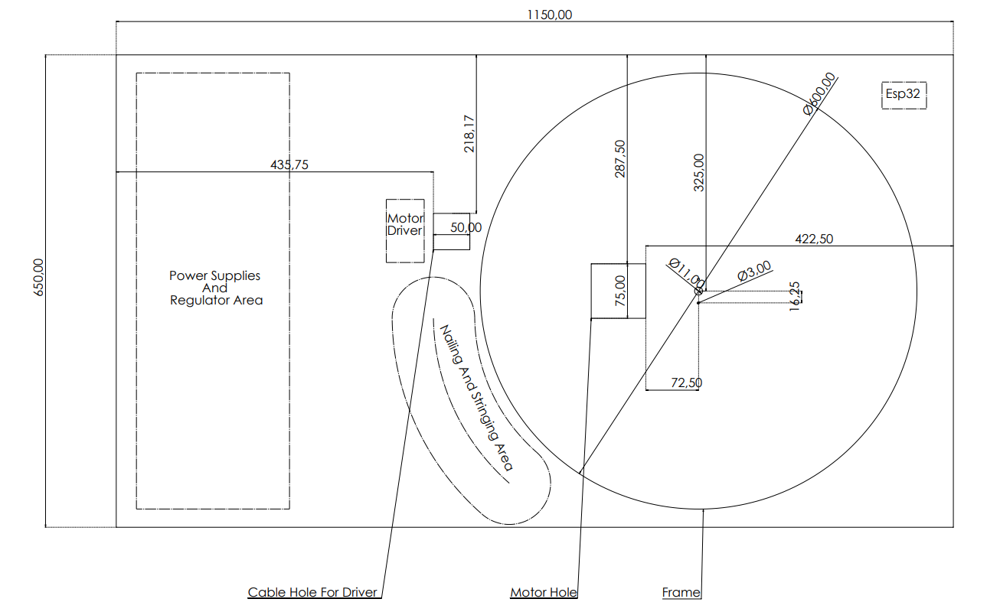

# String-Art-Machine
An automated String Art machine that performs both the automated nailing process and the string weaving process.

## Introduction

This project presents an automated String Art machine designed to handle both the automated nailing and string weaving processes. The system architecture integration and control flow are built upon the following core components:

* **Control Unit & Embedded System:** Powered by an **ESP32-WROOM-32d** microcontroller managing real-time motion control, sensor data processing, and execution commands.
* **Software & Image Processing:** A **Python**-based framework is utilized to convert digital source images into optimized string-path coordinates and numerical control data.
* **Position Tracking & Feedback System:** To ensure high-precision positioning and prevent accumulative mechanical errors during operation, the system employs a robust feedback mechanism:
  * A **NEMA23 Closed-Loop Stepper Motor** with an integrated encoder to prevent step loss.
  * **Optical Limit Switch Endstops** serving as red-light sensors for precise homing, position validation, and path tracking.

## Hardware Components

The primary hardware and mechatronic components utilized in this project are listed below along with their corresponding visual documentation and technical reference links:

### 1. Controllers & Microcontrollers
* **Microcontroller:** [ESP32-WROOM-32](https://documentation.espressif.com/esp32-wroom-32_datasheet_en.pdf)(Handles real-time motion control and sensor data processing)

### 2. Actuators, Drivers & Encoders
* **Motor:** [NEMA23 Closed Loop Stepper Motor (CS-M22323)](https://www.damencnc.com/userdata/file/6023-3_Closed_Loop_Stepper_Motor_NEMA23-2.3Nm_CS-M22323_2D_Dimensions.pdf) (2.3 Nm) with integrated encoder to prevent step loss.

* **Driver:** [CS-D508 Encoder-Integrated Stepper Motor Driver](http://leadshineusa.com/UploadFile/Down/CS-D508_m3.1.pdf) (24-48V).

### 3. Power Supplies (SMPS)
The system utilizes dedicated Switch Mode Power Supplies to separate power stages for stability:
* **48V Supply:** [MT-500-48 SMPS](https://mervesanteknoloji.com/statics/file/MT-500-xx-_2.pdf) (48V, 10A) - Powering the main motor drivers.

* **36V Supply:** [MT-350-36 SMPS](https://mervesanteknoloji.com/statics/file/2020-6-8_user_manual_MT-350-XX_2_1.pdf) (36V, 10A).

* **24V Supply:** [Mervesan MT-250-24 SMPS](https://mervesanteknoloji.com/statics/file/MTLRS-250-24_Manua_ver-1.0.pdf) (24VDC, 10A).

### 4. Voltage Regulation (DC-DC Step-Down)
* **High-Power Buck Converters:** 3x [XL4016 DC-DC Step Down Regulator Modules](https://www.mikrocontroller.net/attachment/534859/XL4016_Step_Down_Buck_DC_DC_Converter.pdf) (300W, 10A).
  * *Note on Implementation:* One of these buck converters replaces a standard XL4016 module, as the high-capacity XL4016 was readily available and deployed to maintain power consistency across the logic and sensor circuits.
* **XL4016 300w:**

* **XL4016 200w:**

### 5. Sensors & Position Tracking
* **Optical Sensors:** [Optical Limit Switch Endstops](https://www.handsontec.com/dataspecs/sensor/Optical%20end%20stop.pdf) (Dimensions: 33 x 12 x 10 mm) used for precise homing, position validation, and path tracking.

## Mechanical Design & Assembly

The mechanical structure of the String Art machine is detailed in this section. The design progresses from the top-level system assembly down to the individual custom-designed components.

### 1. System Overview (Top View)
The main layout of the system, illustrating the positioning and integration of the mechanical and electronic sub-assemblies, is provided below.
* **Top View Drawing:** [`drawing_top_view.pdf`](./solid/drawing_top_view.pdf)

### 2. Custom Components
The following custom parts were designed for the physical construction of the machine. Universal `.step` files are provided for replication, alongside visual references for each component.

* **Drill Main Unit:** Core housing for the drilling mechanism.
  * **File:** [`drill_main_unit.step`](./solid/drill_main_unit.step)
  * *[Drill Main Unit Screenshot Here]*

* **Drill Mounting Rod:** Structural support component for the drill unit.
  * **File:** [`drill_mounting_rod.step`](./solid/drill_mounting_rod.step)
  * *[Drill Mounting Rod Screenshot Here]*

* **Drill Servo Gear:** Transmission gear for the servo-actuated mechanism.
  * **File:** [`drill_servo_gear.step`](./solid/drill_servo_gear.step)
  * *[Drill Servo Gear Screenshot Here]*

* **Motor Mount:** Bracket designed to secure the NEMA23 closed-loop stepper motors.
  * **File:** [`motor_mount.step`](./solid/motor_mount.step)
  * *[Motor Mount Screenshot Here]*

* **Slider End:** End effector and guide component for the linear motion axis.
  * **File:** [`slider_end.step`](./solid/slider_end.step)
  * *[Slider End Screenshot Here]*

* **Chassis:** The primary structural frame supporting the entire operation.
  * **File:** [`chassis.step`](./solid/chassis.step)
  * *[Chassis Screenshot Here]*

* **Table / Bed:** The main work surface where the string art generation takes place.
  * **File:** [`table_bed.step`](./solid/frame.step)
  * *[Frame Screenshot Here]*
